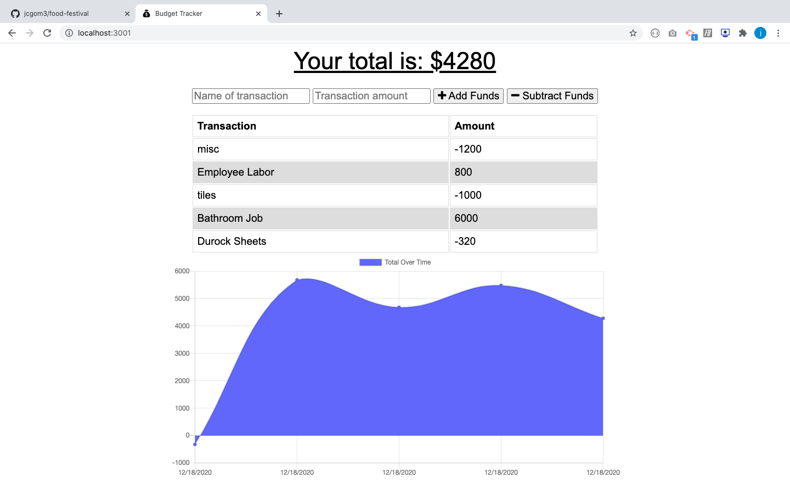

# Budget Tracker Starter Code

## Tools Used

* JavaScript
* Node.js
* Express
* Mongodb
* Mongoose
* Dotenv
* PWA
* Service workers

# Snapshot

[]

# Description
This app allows to create and use 

# Table of Contents 
* [Description](#Description)
* [Installation & Database SetUp](#Installation)
* [Walk-through-Video](#Walk-through)
* [License](#license)
* [Contributing](#contributing)
* [Tests](#tests)
* [Questions](#questions)

# Installation & Database SetUp
* To use this app npm init has to be called to create your package.json file.
* The following necessary Npm dependencies must be installed to run the application properly: the needed dependencies will be found on the package.json file.
* To properly install the database you must create at cluster on Mongodb atlas.
* Run "npm run dev" for the port to start listening with mongoose.

# Walk-through Video

# Heroku

(https://app-budget-tracker-pwa.herokuapp.com/)

# License

# Contributing
​Contributors: N/A

# Tests
N/A

# Questions?
## Please contact me:
  * [My GitHub Profile](https://github.com/jcgom3)
  * [My Github Project Repository](https://github.com/jcgom3/Challenge-19-PWA-Budget-Tracker/)
  * [My Github Deployed IO](https://jcgom3.github.io/Challenge-19-PWA-Budget-Tracker/)
  * Email us at: [Jcgom3@gmail.com](mailto:Jcgom3@gmail.com) with questions or make an issue about this project.